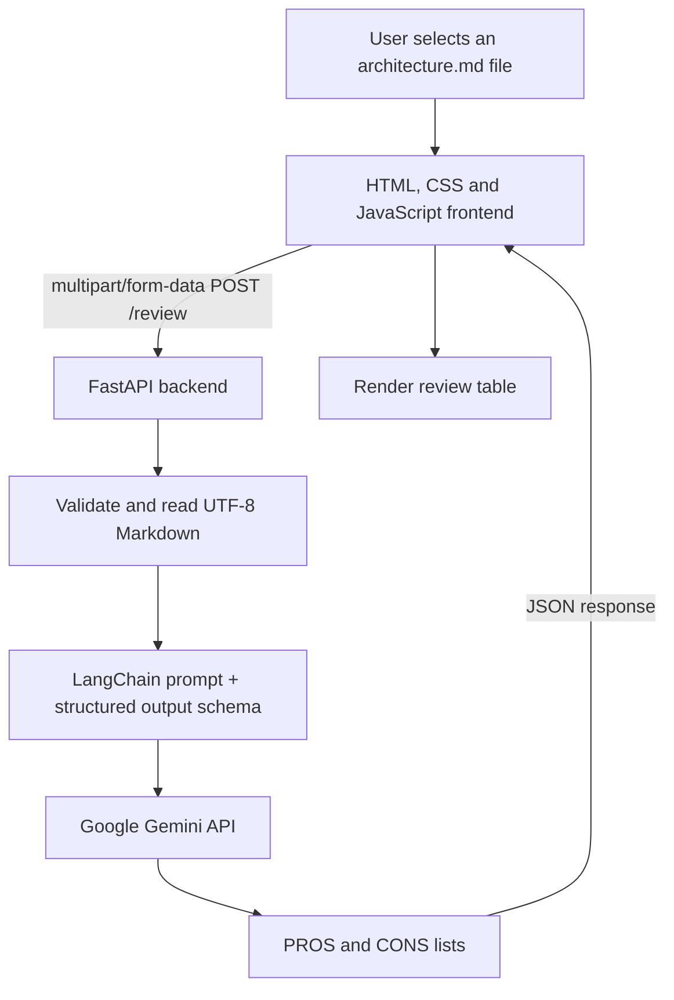

# 🏛️ AI Architecture Reviewer

**AI-assisted feedback for software architecture documented in Markdown.**

Upload a Markdown (`.md`) file containing a system architecture description, a text-based diagram (such as Mermaid), and design considerations. The application sends the document to Google Gemini through LangChain and displays a concise review in a **PROS / CONS** table.

**🌐 [Try the live application](https://ai-architecture-reviewer-6si2.onrender.com/)** · **📡 [API documentation](https://ai-architecture-reviewer-6si2.onrender.com/docs)**

> **📌 Scope:** This version analyzes the *text* in uploaded Markdown files, including textual diagram definitions. It does not interpret embedded image files or verify that an architecture has been implemented as described. AI feedback is a starting point for human review, not a definitive audit.

## 🚀 Features

- 📤 Upload `.md` architecture documents through a browser-based interface.
- ✅ Validate the filename extension, UTF-8 text encoding, and nonempty content before reviewing.
- 🧠 Review described architectural decisions with an LLM, considering scalability, security, performance, maintainability, and reliability.
- 🧩 Request structured AI output with separate `pros` and `cons` lists using a Pydantic schema.
- 📊 Display review points side by side in an automatically populated HTML table.
- 📚 Provide an interactive FastAPI API reference at `/docs`.

## 🔄 How it works



1. The browser selects the Markdown file and sends it to `POST /review` using `FormData` and `fetch()`.
2. FastAPI checks the filename, decodes the upload as UTF-8, and rejects empty content.
3. LangChain sends the document and review instructions to the configured Gemini model.
4. Gemini returns a response in the `ArchitectureReview` schema: two lists of strings named `pros` and `cons`.
5. FastAPI returns the filename, content type, and review as JSON. JavaScript renders the two lists in a table.

## 🛠️ Technology stack

| Layer | Technology | Role |
| --- | --- | --- |
| 🎨 Frontend | HTML, CSS, JavaScript | File selection, upload, loading/error messages, and review table |
| 🐍 Backend | Python, FastAPI | Upload validation, request handling, and JSON responses |
| 🔗 Model integration | LangChain (`langchain-google-genai`) | Gemini invocation and structured output |
| ✅ Data validation | Pydantic | Defines the API and AI-review response schemas |
| 🤖 AI model | Google Gemini | Generates architecture review points from Markdown text |
| ☁️ Hosting | Render | Hosts the web page and FastAPI service |
| 🌿 Source control | Git and GitHub | Version control and source-code hosting |

The model identifier configured in the current backend is `gemini-3.5-flash-lite`. Model availability and API usage limits depend on the Google API project and provider policies.

## 📁 Project structure

```text
AI_Architecture_Reviewer/
├── app/
│   ├── main.py                    # FastAPI routes, validation, prompt, model invocation
│   └── templates/
│       ├── index.html             # Web interface
│       ├── style.css              # Styling
│       └── script.js              # File upload and review rendering
├── examples/
│   └── test-architecture.md       # Sample Markdown architecture
├── .gitignore                     # Excludes local secrets, environment and caches
├── requirements.txt               # Python dependencies
└── README.md
```

A local `.env` file and `.venv/` directory are used during development and are intentionally not committed. You may also keep a local `test_llm.py` script for experimenting with the Gemini connection.

## ⚙️ Run locally

### 📋 Prerequisites

- A supported Python 3 installation with `pip` (Python 3.11 or newer is a practical starting point).
- A Google Gemini API key from [Google AI Studio](https://aistudio.google.com/api-keys), with access to the model configured in `app/main.py`.

### 1. 📥 Clone the repository

```bash
git clone https://github.com/Flora811/AI_Architecture_Reviewer.git
cd AI_Architecture_Reviewer
```

### 2. 🐍 Create and activate a virtual environment

**Windows PowerShell**

```powershell
py -m venv .venv
.\.venv\Scripts\Activate.ps1
```

**macOS / Linux**

```bash
python3 -m venv .venv
source .venv/bin/activate
```

### 3. 📦 Install dependencies

```bash
python -m pip install -r requirements.txt
```

### 4. 🔐 Configure your API key

Create a file called `.env` in the project root:

```dotenv
GOOGLE_API_KEY=your_gemini_api_key_here
```

Replace the placeholder with your own key. The backend reads it through `python-dotenv`.

### 5. ▶️ Start the application

```bash
python -m uvicorn app.main:app --reload --reload-dir app
```

Open **[http://127.0.0.1:8000/](http://127.0.0.1:8000/)** in your browser. Interactive API documentation is available at **[http://127.0.0.1:8000/docs](http://127.0.0.1:8000/docs)**.

## 🖥️ Use the application

1. Open the [live application](https://ai-architecture-reviewer-6si2.onrender.com/) or your local server.
2. Select a UTF-8 `.md` file that describes your system architecture and relevant design considerations.
3. Click **Review Architecture**.
4. Read the generated PROS and CONS. Review the claims against your actual requirements and deployment design.

The repository includes [`examples/test-architecture.md`](examples/test-architecture.md) for a quick test. For useful feedback, include the system's components, relationships, technologies, constraints, expected load, and known deployment/security decisions where available.

## 📡 API reference

### 🏠 `GET /`

Serves the web interface (`index.html`).

### 📤 `POST /review`

Accepts one uploaded file under the form field name `file`.

**Request:** `multipart/form-data`, with a UTF-8 `.md` file.

**Example successful response** (illustrative; generated review text varies):

```json
{
  "filename": "test-architecture.md",
  "content_type": "text/markdown",
  "review": {
    "pros": [
      "The architecture separates the frontend, backend, and data storage responsibilities."
    ],
    "cons": [
      "The deployment and scaling strategies are not documented."
    ]
  }
}
```

**Validation responses:**

- `200 OK` — review generated and returned.
- `400 Bad Request` — filename does not end in `.md`, text is not valid UTF-8, or the decoded file is empty.
- `422 Unprocessable Entity` — required upload field is missing or malformed.

Provider failures, quota limits, and unexpected server errors are not yet handled with custom user-facing API responses; they may surface as server errors.

## ☁️ Deployment

The application is deployed as a **Render Web Service** with its frontend and FastAPI backend served from the same origin.

- **Build command:** `pip install -r requirements.txt`
- **Start command:** `uvicorn app.main:app --host 0.0.0.0 --port $PORT`
- **Environment variable:** `GOOGLE_API_KEY` (configured privately in Render)

## 👤 Author

<p align="center"><strong>✨✨✨ Flora Bhatt ✨✨✨</strong></p>

<div align="center">
  <strong>🌟 Connect With Me:</strong><br><br>
  <a href="https://www.github.com/Flora811">
    
  </a>
  &nbsp;&nbsp;&nbsp;
  <a href="https://www.linkedin.com/in/flora--bhatt">
    
  </a>
  &nbsp;&nbsp;&nbsp;
  <a href="https://flora811.github.io/Portfolio-Website/">
    
  </a>
</div>
